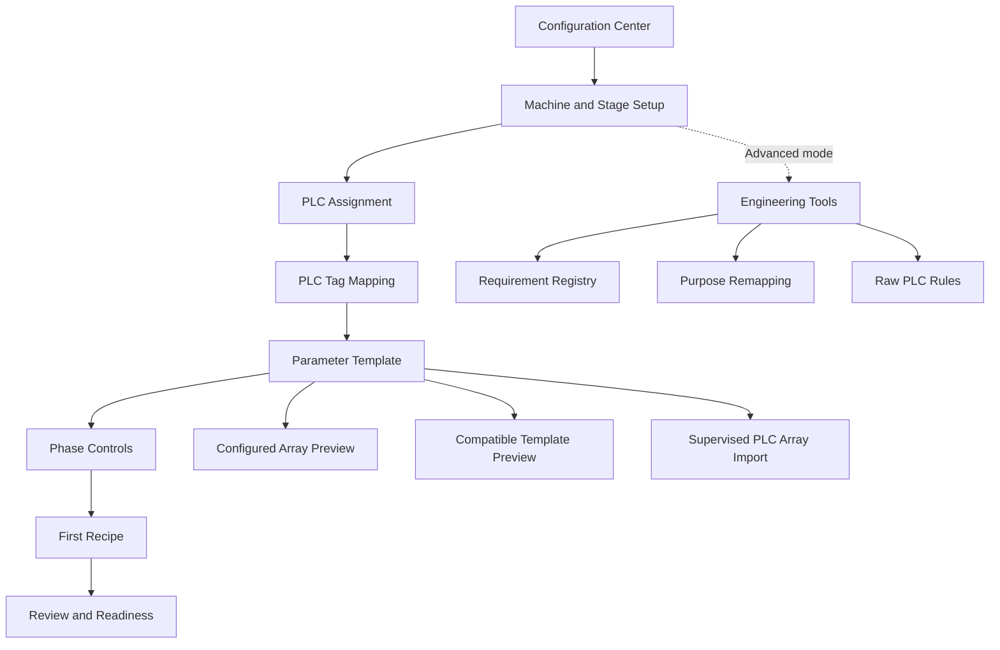

# Before and after workflow

## Before V13.1

```text
Configuration Center
  -> Open Setup
  -> one long technical page
     -> PLC assignment
     -> editable requirement registry
     -> tag repair and remapping
     -> parameter link
     -> phase link
     -> readiness sections
     -> recipe links
```

The page exposed domain internals, generic Open actions, and no saved current step. Parameter rows could be created from a configured array, but there was no separate review page before commit.

## After V13.1

```text
Configuration Center
  -> Start Setup / Resume Setup
  -> 1 Machine and Stage
  -> 2 PLC Assignment
  -> 3 PLC Tag Mapping
  -> 4 Parameter Template
       -> choose source
       -> enter range/defaults
       -> preview creates vs preserves
       -> reason and commit
       -> bulk engineering review
  -> 5 Phase Controls
  -> 6 First Recipe
  -> 7 Review and Readiness
```

Engineering Tools remains available in Advanced mode for raw stage requirement rules and repair controls.

## Information architecture



